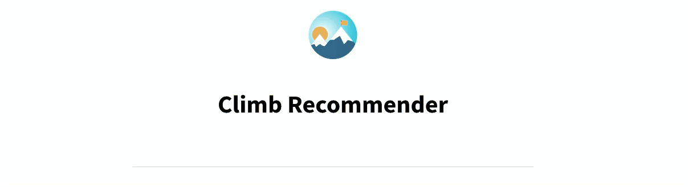
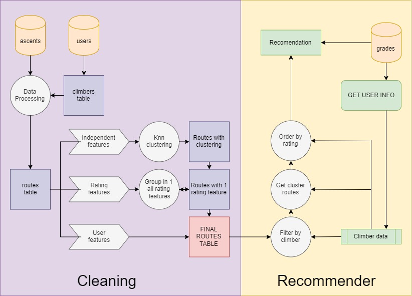

# Climbing Route Recommender

This repository recommends sports-climbing routes

## Overview

I created a route recommender based on the features of the routes. I took the databases scrapped from the website 8a.nu and cleaned them. After cleaning I used K-means modelling to cluster the data and get a table of clustered routes. With that information and the routes ratings I was able to build a recommender based on the user's input features and routes climbed.

I also created an app using this recommender. I deployed it in:

- Heroku, you can find it online on [this link](https://route-recommender-app-eu.herokuapp.com/)

- AWS EC2 using docker, you can find it on [this link](http://13.38.224.3:8501/). As long as my EC2 instance is up.

## Contents

Notebooks
1. `src/1.get_routes_table.ipynb` - Where I get routes table by cleaning and playing with the ascents table
2. `src/2.clustering_routes.ipynb` - Where I apply K-Means model to cluster the routues by their features
3. `src/3.routes_rating.ipynb` - Where I get the routes global rating from different features
4. `src/4.route_recommender.ipynb` - Where I define the route recommender

Clases
1. `src/lib/climber_class.py` - User class
2. `src/lib/location_class.py` - Class for the location
3. `src/lib/text_processor_class.py` - It contains sentiment, language recognition, word matching and cleaning. 
4. `src/lib/grades_class.py` - Used for the class conversor

Guides
- I created these guides to understand how my classes work
1. `GUIDE.climber_class.ipynb`
2. `GUIDE.grades_conversor_class.ipynb` 
3. `GUIDE.location_class.ipynb`
4. `GUIDE.text_processor_class.ipynb`

Streamlit
1. `app/app.py` - The app in streamlit.

## Description

In this section I explain the whole process. You can find the notebook files on the `src/` folder numbered, so it will be easier to follow. In the end of this document there is a diagram explaining the workflow.

### Steps
#### Obtain Routes Table
In order to obtain the routes list features I took an 'ascents table' and converted it into a 'routes table'. For that purpose I had to:
1. String cleaning for each column (using class `text_processor_class.py`)
2. Sentiment (first checks language and then if comments are positive or negative, using class `text_processor_class.py`)
3. Splitting
4. Cleaning and filtering outlayers
5. Adding climbers table features (this table was obtained from ascents table as well, how to in [this project](https://github.com/jordi-zaragoza/Climbing-Data-Analysis))
6. Clean and group naming (it compares names and replaces if they are alike, using class `text_processor_class.py`)

#### Modelling Features
I separated the features in 3 types:
1. Independent features - I created groups or clusters using K-Means modeling and visualized using PCA. Every route was asigned to a cluster.
2. Rate features - These features were analyzed using PCA and finally mixed into a single feature that will sort the cluster option
3. User features - - These ones are defined by user and are used as a filter. 

#### Recommender
With the final table I was able to create a recommender based on new user features and climbed routes. I created an app to make it easier and more user friendly. You can input the climber information and the recommender will output the recommended routes per region, cluster and ordered by rating.

### Clusters 
Clusters (more or less) explanation
- 0 - Soft routes
- 1 - Routes for some reason preferred by women
- 2 - Famous routes 
- 3 - Very hard routes
- 4 - Very repeated routes
- 5 - Chipped routes, with soft rate
- 6 - Traditiona, not chipped routes
- 7 - Easy to On-sight routes, not very repeated
- 8 - Very famouse routes but not so repeated and not so traditional

## Databases

- This repository uses 3 different databases. Users, ascents and grades.

- The data is not stored here but you can find them in this link: https://www.kaggle.com/dcohen21/8anu-climbing-logbook

## Acknowledgments
Thanks to David Cohen for creating the scrapper (https://github.com/mplaine/8a.nu-Scraper) and hosting the data on Kaggle website (https://www.kaggle.com/dcohen21/8anu-climbing-logbook)

## Requirements
- matplotlib==3.3.4
- numpy==1.19.5
- pandas==1.4.1
- polyglot==16.7.4
- regex==2020.11.13
- scikit_learn==1.0.2
- scipy==1.6.0
- seaborn==0.11.2
- sentiment_analysis_spanish==0.0.25
- streamlit==1.8.0
- vaderSentiment==3.3.2

## Diagram

